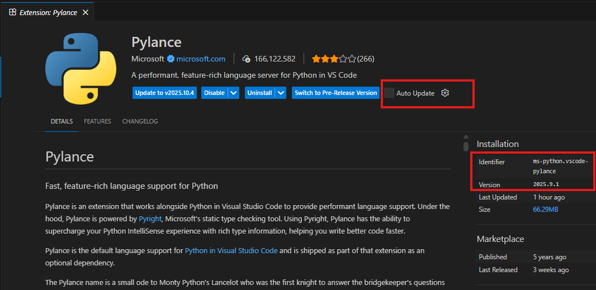
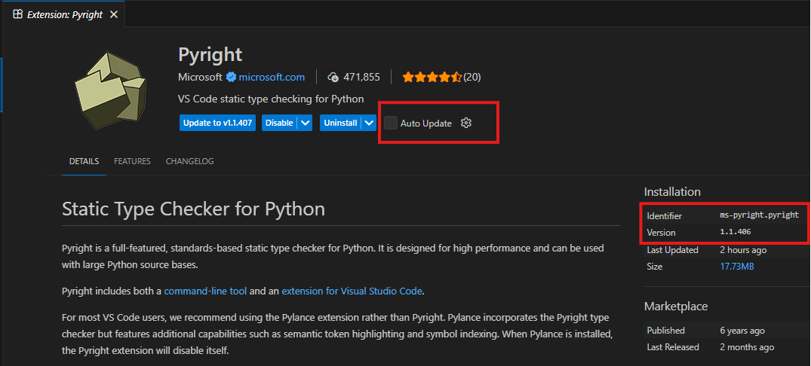

# VSCode Plugin Setup for Pyright/Pylance

This document describes how to manually install specific versions of the Pylance and Pyright VSCode plugins.

## Background

There is a known issue with pyright version 1.1.407 that causes false positive errors with pydantic dataclasses (see [issue #149](https://github.com/microsoft/typeagent-py/issues/149)). The errors manifest as incorrect warnings like:

- `No parameter named "text"` (reportCallIssue)
- `Expected 0 positional arguments` (reportCallIssue)
- `Cannot access attribute "..." for class "PydanticDataclass"` (reportAttributeAccessIssue)

To avoid these false errors in VSCode, you need to use plugin versions that include pyright 1.1.406.

## Required Plugin Versions

The following VSCode plugin versions use pyright 1.1.406 internally:

### Pylance Plugin

- **Identifier:** `ms-python.vscode-pylance`
- **Required Version:** 2025.9.1 (21 October 2025)
- **Changelog:** https://marketplace.visualstudio.com/items/ms-python.vscode-pylance/changelog

### Pyright Plugin

- **Identifier:** `ms-pyright.pyright`
- **Required Version:** 1.1.406 (Oct 1, 2025)
- **Changelog:** https://marketplace.visualstudio.com/items/ms-pyright.pyright/changelog
- **Release Notes:** https://github.com/microsoft/pyright/releases/tag/1.1.406

## How to Manually Install a Specific Plugin Version

1. **Open the Extensions view** in VSCode (`Ctrl+Shift+X` or `Cmd+Shift+X` on macOS)

2. **Search for the extension** by name (e.g., "Pylance" or "Pyright")

3. **Click on the extension** to open its details page

4. **Click the gear icon** (⚙️) next to the "Uninstall" button

5. **Select "Install Another Version..."** from the dropdown menu

6. **Choose the required version** from the list:
   - For Pylance: select version `2025.9.1`
   - For Pyright: select version `1.1.406`

7. **Disable automatic updates** for the extension (optional but recommended):
   - Click the gear icon again
   - Select "Ignore Updates" to prevent VSCode from auto-updating to a newer (potentially broken) version

8. **Restart VSCode** to ensure the changes take effect

## Plugin Version Screenshots

### Pylance Plugin (Version 2025.9.1)

### Pyright Plugin (Version 1.1.406)

## Notes

- You typically only need **one** of these plugins (Pylance or Pyright), not both
- Pylance is the more full-featured option and includes Pyright internally
- Make sure your `.venv` is properly configured and selected in VSCode's Python interpreter picker (shown in the status bar at the bottom)
